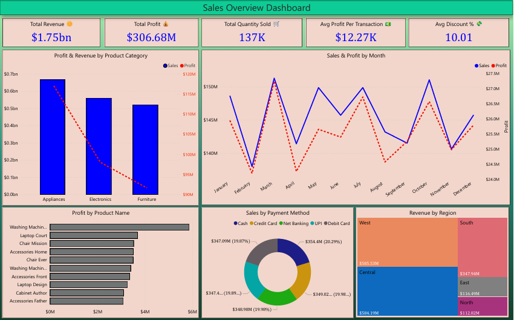
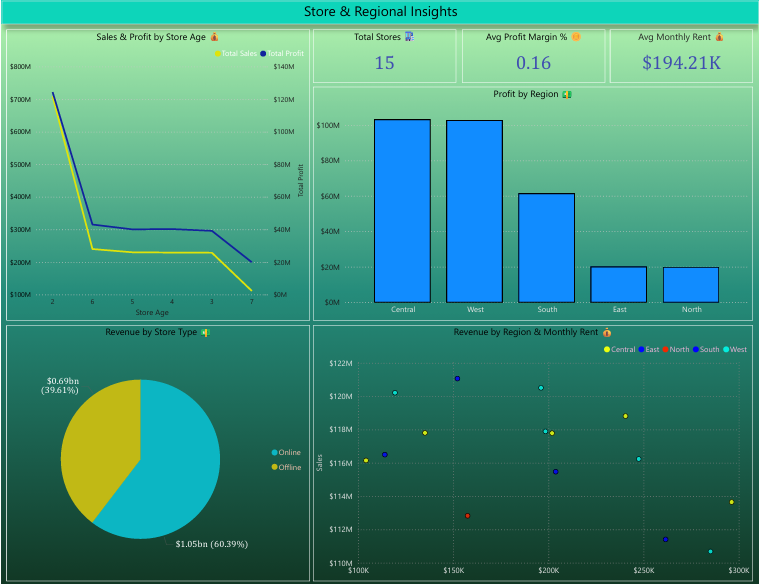
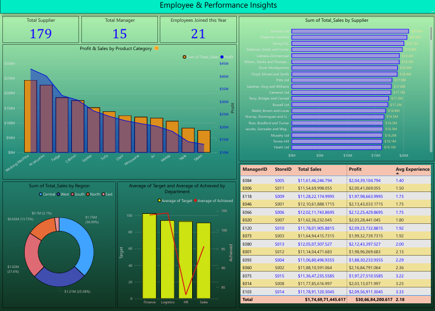

# 🧠 Business Operations & Management Insights Dashboard

A complete **Power BI dashboard** analyzing business performance across multiple operational and managerial dimensions — including sales, profit, stores, suppliers, managers, and employees.

---

## 📊 **Overview**

This project provides an end-to-end business intelligence solution built in **Power BI Desktop**, designed to uncover actionable insights from sales and operational data.

### ⚙️ **Dashboard Pages**
1️⃣ **Sales Overview** — Revenue, Profit, Quantity, and Regional Sales Analysis  
2️⃣ **Store & Regional Insights** — Store type performance, rent analysis, and profit distribution  
3️⃣ **Operational & Management Insights** — Supplier contribution, manager performance, and employee experience trends  

---

## 💡 **Key Highlights & Insights**
- **Total Revenue:** $1.75B | **Total Profit:** $306.68M  
- **Central Region** leads with the highest revenue share (~37%)  
- **Online stores** contribute **60.39%** of total sales  
- **Top Supplier:** *Johnson Ltd* — $20.9M in total sales  
- **Manager E046** achieved the highest profit margin (~$2.13M profit)  
- **Average Employee Experience:** 2.18 years  
- Department-level **Target vs Achieved** analysis provides performance clarity  

---

## 🖼️ Dashboard Preview

Below are the three pages of the **Business Operations & Management Insights Dashboard**, exported directly from Power BI.

### 📄 Page 1 – Sales Overview

### 📄 Page 2 – Store & Regional Insights

### 📄 Page 3 – Operational & Management Insights

---
## 🧰 **Technical Details**

### 🔹 Tools Used
- **Power BI Desktop**
- **Power Query**
- **DAX (Data Analysis Expressions)**

### 🔹 Features
- Data cleaning and transformation  
- Dynamic KPIs and calculated measures  
- Multi-page interactive dashboard  
- Visual storytelling with supplier, store, and employee metrics  

---

## 📁 **Files Included**
- `Business_Operations_and_Management_Insights_Dashboard.pdf` – Full dashboard export  
- (Optional) `Business_Operations_and_Management_Insights.pbix` – Power BI source file  

---

## 📈 **Project Learnings**
- Designing consistent, professional dashboards  
- Building calculated columns and DAX measures for insights  
- Combining financial, operational, and HR data for a holistic view  
- Structuring multi-page dashboards with logical flow  

---

## 🔗 **Portfolio & Connect**
If you’d like to explore more of my projects or collaborate, feel free to connect!  

🌐 [LinkedIn Profile](https://www.linkedin.com/in/anshumaan-mishra-211118365/)  
💼 [Fiverr Profile](https://www.fiverr.com/users/mi9ans/seller_dashboard)  

---

### 🏷️ **Tags**
`#PowerBI` `#DashboardDesign` `#DataVisualization` `#BusinessIntelligence` `#Analytics` `#PortfolioProject`

---

